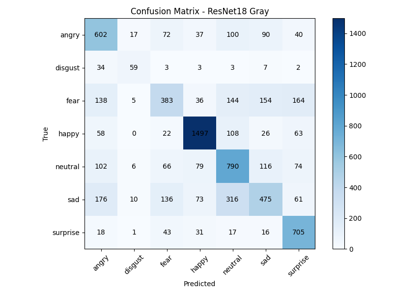
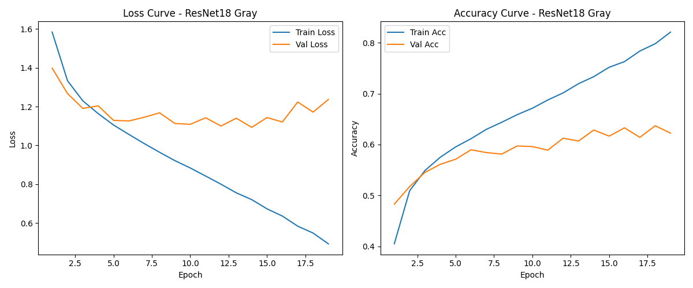

# Emotion Recognition Demo

Real-time facial emotion recognition from laptop webcam using PyTorch, ResNet18, OpenCV, and FER2013.

## Overview

This project trains a grayscale ResNet18 model on the FER2013 dataset for 7-class facial emotion recognition and uses the trained model for real-time webcam inference.

The model predicts the following emotions:

- angry
- disgust
- fear
- happy
- neutral
- sad
- surprise

The webcam demo uses:
- OpenCV Haar Cascade for face detection
- a grayscale ResNet18 classifier for emotion recognition
- EMA smoothing for more stable predictions
- confidence and top-1/top-2 margin filtering to reduce unstable outputs

## Repository Structure

```bash
emotion-recognition/
├── models/
├── results/
│   ├── confusion_matrix_resnet18_gray.png
│   └── learning_curves_resnet18_gray.png
├── train.py
├── infer_webcam.py
├── requirements.txt
├── .gitignore
└── README.md
```

## Dataset

This project uses the FER2013 dataset for 7-class facial emotion recognition.

Download the dataset from Kaggle:
https://www.kaggle.com/datasets/msambare/fer2013

After downloading, organize the dataset like this:

```bash
emotion-recognition/
├── data/
│   └── fer2013/
│       ├── train/
│       │   ├── angry/
│       │   ├── disgust/
│       │   ├── fear/
│       │   ├── happy/
│       │   ├── neutral/
│       │   ├── sad/
│       │   └── surprise/
│       └── test/
│           ├── angry/
│           ├── disgust/
│           ├── fear/
│           ├── happy/
│           ├── neutral/
│           ├── sad/
│           └── surprise/
```

## Installation

Clone the repository and install dependencies:

```bash
git clone https://github.com/ArthurKael/emotion-recognition.git
cd emotion-recognition
pip install -r requirements.txt
```

## Train the Model

The trained model checkpoint is not included in this repository because the `.pth` file is too large to upload through GitHub web.

To train the model locally, run:

```bash
python train.py
```

This script will:

- build a ResNet18 model modified for 1-channel grayscale input
- train on FER2013 with class-weighted cross-entropy loss
- apply early stopping
- save the best model checkpoint to:

```bash
models/emotion_resnet18_gray.pth
```

It will also save the following result files:

```bash
results/confusion_matrix_resnet18_gray.png
results/learning_curves_resnet18_gray.png
```

## Run Webcam Inference

After training is complete and the model checkpoint has been saved, run:

```bash
python infer_webcam.py
```

This script will:

- open the laptop webcam
- detect faces using OpenCV Haar Cascade
- classify facial emotions in real time
- smooth prediction probabilities using EMA
- use confidence and prediction margin rules to reduce unstable outputs

Press `Q` to quit the webcam window.

## Training Details

Model:
- ResNet18
- first convolution layer modified from 3-channel RGB input to 1-channel grayscale input

Training settings:
- image size: 96x96
- batch size: 128
- learning rate: 1e-3
- optimizer: Adam
- early stopping patience: 5
- maximum epochs: 25
- loss function: weighted cross-entropy

## Results

Best test accuracy achieved:

- **62.84%**

Saved evaluation outputs:
- confusion matrix
- training and validation learning curves




## Notes

- You must train the model locally before running `infer_webcam.py`.
- If your webcam does not open, try changing:

```python
cv2.VideoCapture(0)
```

to:

```python
cv2.VideoCapture(1)
```

## Limitations

- Real-time emotion recognition is sensitive to lighting, head pose, and facial ambiguity.
- Neutral expressions may sometimes be confused with fear or sad.
- Clear expressions such as happy and surprise are generally more reliable in the webcam demo.

## Future Work

- Add downloadable pretrained weights through GitHub Release or an external link
- Replace Haar Cascade with a stronger face detector for better robustness
- Build a small Gradio or Streamlit demo
- Try transfer learning with pretrained backbone weights

## Author

Nguyen Van Khang
